# SnakZee Storefront - Handover & Administrator Documentation

Welcome to the official handover manual for the **SnakZee** e-commerce storefront. This document is designed for the client to understand, configure, run, and manage the website and its content management system (Sanity CMS) successfully.

---

## Table of Contents
1. **Introduction & Project Overview**
2. **System Architecture**
3. **Storefront Features & User Experience (with Screenshots)**
4. **Local Development Setup & Prerequisites**
5. **Environment Configuration**
6. **Administrator Guide: Editing Content in Sanity CMS**
   - Accessing the Admin Studio & Main Desk Panel
   - Customizing the About Section
   - Customizing Category Cover Images
   - Managing Dynamic Delivery Costs & Offers
   - Adding and Managing Products
   - Managing Customer Testimonials
7. **Order Logging & Supabase Integration**
8. **Deployment Guide**

---

## 1. Introduction & Project Overview
SnakZee is a premium, modern e-commerce storefront dedicated to delivering authentic Telugu flavors (traditional snacks, masalas, sweets, and pickles). The storefront is designed with a premium, traditional maroon and gold visual style, featuring responsive design, dynamic categories, customer reviews, dynamic shopping cart calculators, database-logged checkout, and direct WhatsApp order dispatching.

---

## 2. System Architecture
The application is built using a modern, fast, and optimized technology stack:
*   **Frontend Framework**: Next.js 16 (App Router) using React 19 and TypeScript.
*   **Styling**: Vanilla CSS alongside TailwindCSS v4 for high performance and rapid layout styling.
*   **Content Management System (CMS)**: Sanity.io Studio v3 (embedded locally inside the Next.js app at the `/studio` route for client convenience).
*   **Database (Order Logging)**: Supabase JS client for logging and preserving order histories before sending them via WhatsApp.
*   **Image Optimization**: Next.js `<Image>` component for resizing and converting images on-the-fly to modern WebP/AVIF formats.

---

## 3. Storefront Features & User Experience

Below is a walkthrough of each storefront section along with the corresponding screenshots for reference:

### A. Homepage & Hero Section
The homepage opens with a sticky navbar, a white-bordered hanging brand logo, a cart overlay badge, and a high-quality Hero banner highlighting the traditional cooking heritage.
*   **Primary Action**: Clicking "Shop Now" smooth-scrolls to the catalog, while the WhatsApp icon button opens a direct chat.
*   **Mantra Banner**: Features the Telugu tagline: **"తెలుగు రుచుల అసలైన చిరునామా"** (*The true destination for authentic Telugu flavors*).

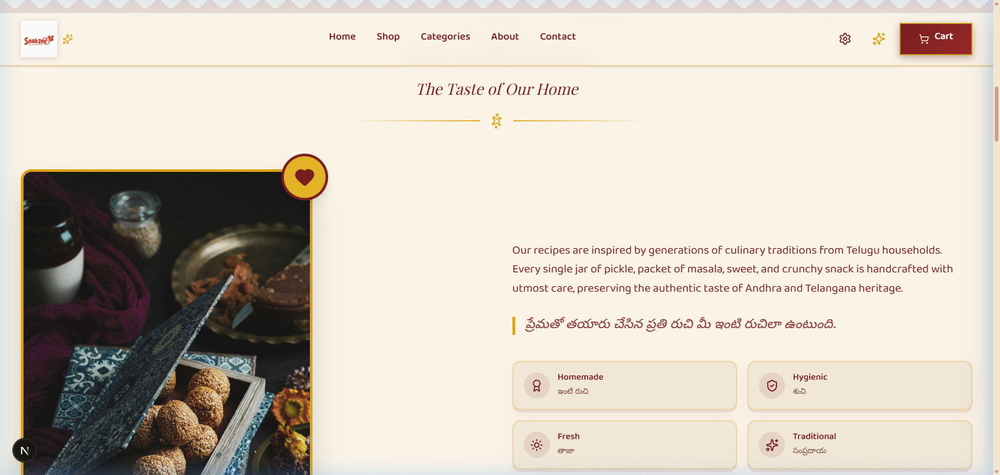

### B. About Section (Brand Heritage)
This section shows the culinary heritage of SnakZee, highlighting that all recipes are handcrafted and preservative-free.
*   **Icons**: Clean, vector-style icons illustrating Homemade (Hand), Fresh (Leaf), Traditional (Award), and Preservative Free (Sparkles).
*   **Story**: Dynamically loaded stories in English and Telugu.

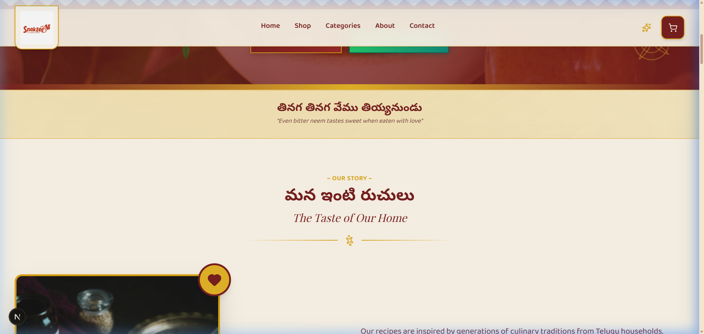

### C. Categories Directory
The directory divides products into four key collections: **Pickles**, **Masalas**, **Sweets**, and **Snacks**.
*   **Visual Cards**: Each category is represented by a dedicated card with custom icons (Flame, Sparkles, Heart, Leaf) and an overlay name.
*   **Interaction**: Clicking a category scrolls to the shop grid and filters products to that category automatically.

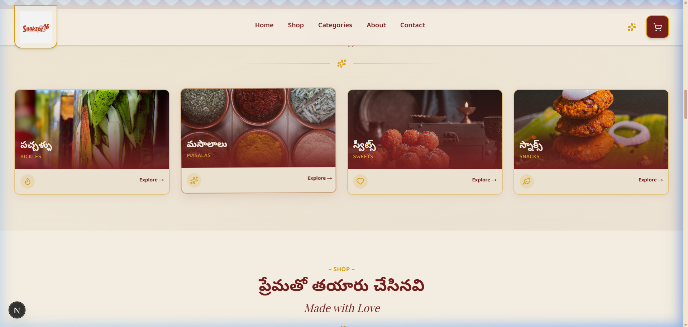

### D. Best Sellers Grid
Located below the shop catalog, this section highlights the customer favorites with a gold star badge label overlay stamp on the bottom right.
*   **Items Featured**: Traditional favorites like Avakaya, Gongura Pickle, and Biryani Masala.

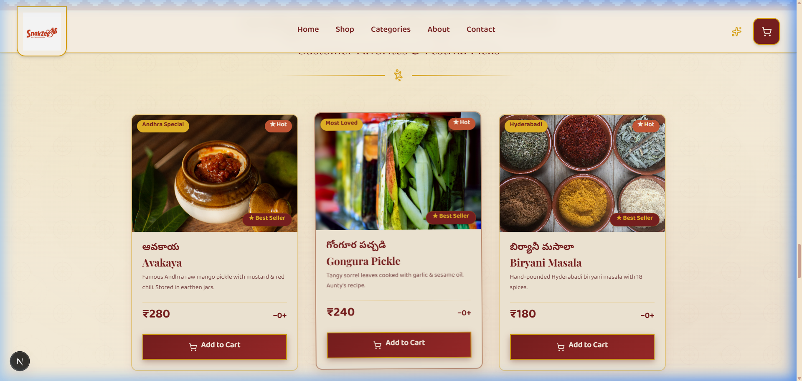

### E. Shopping Cart, Quantity Controls & Checkout Form
Customers can adjust quantities directly from the catalog cards or within the Cart Drawer.
*   **Quantity Selector**: Clean `-` and `+` buttons wrap the numeric quantity control.
*   **Cart Drawer**: Slides out from the right, displaying items, pricing subtotals, dynamic delivery charge, and the checkout button.
*   **Checkout Form Modal**: Clicking "Order on WhatsApp" opens a secure popup form collecting the customer's delivery details: Name, Phone Number, Delivery Address, and 6-digit Pincode.

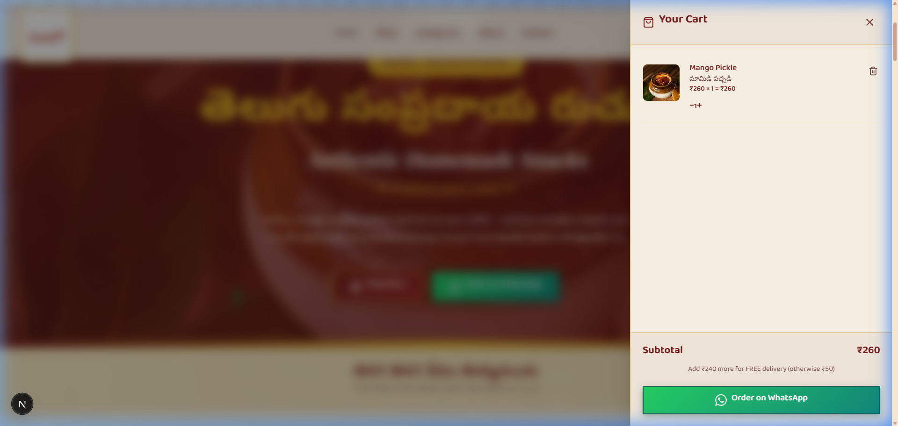
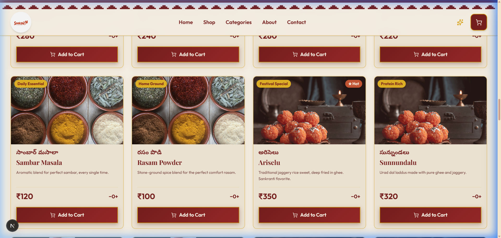
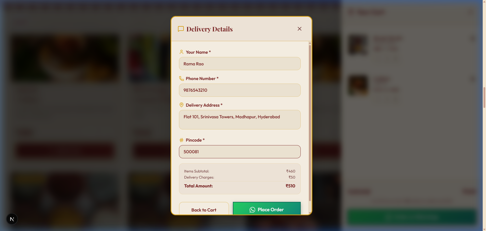

### F. Testimonials Section
Shows reviews from customers in Hyderabad, Visakhapatnam, and Vijayawada. It uses left-aligned text grids and quote icons in gold color.

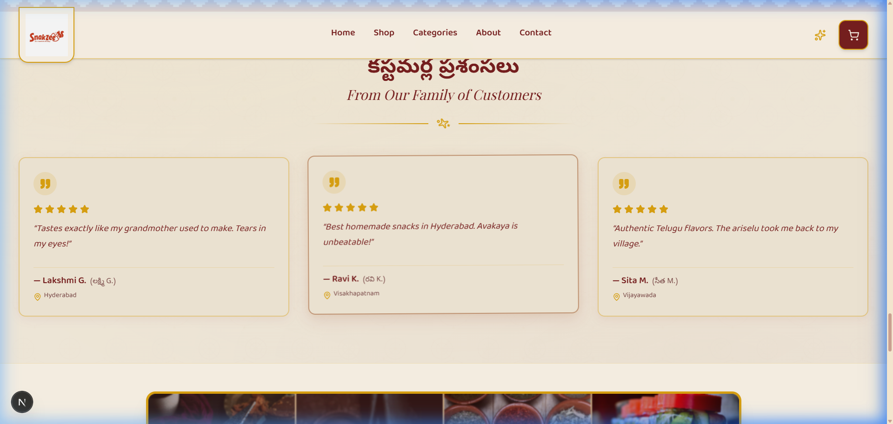

### G. Contact Section (Footer)
The footer features cards containing contact information for direct support: WhatsApp orders, Instagram DMs, and daily preparation assurances.

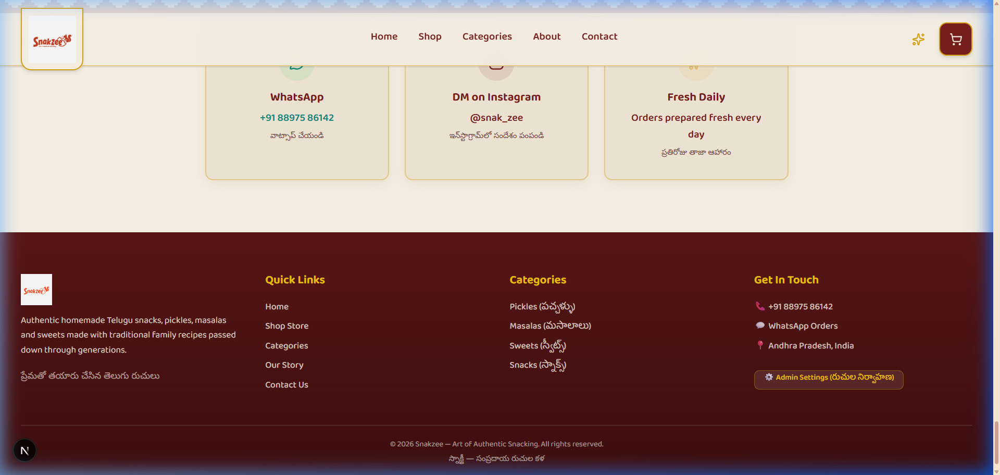

---

## 4. Local Development Setup & Prerequisites

To run the storefront locally on your developer system:

### Prerequisites
1.  **Node.js**: Ensure Node.js (v18.0.0 or higher) is installed on your computer.
2.  **Code Editor**: Visual Studio Code or any editor of your choice.

### Step-by-Step Installation
1.  Extract the project folder and open your terminal inside it.
2.  Install dependencies:
    ```bash
    npm install
    ```
3.  Launch the development server:
    ```bash
    npm run dev
    ```
4.  Open [http://localhost:3000](http://localhost:3000) in your browser. The site will load with local fallback mock data if no database credentials are set.

---

## 5. Environment Configuration
Create a `.env.local` file in the project's root directory. Add the following environment variables to link the storefront to your cloud Sanity CMS and Supabase database:

```env
# Sanity CMS Project Configuration
NEXT_PUBLIC_SANITY_PROJECT_ID="55l3y358"
NEXT_PUBLIC_SANITY_DATASET="production"

# Supabase Order Logging Credentials (Optional, falls back to console logging)
NEXT_PUBLIC_SUPABASE_URL="https://your-project.supabase.co"
NEXT_PUBLIC_SUPABASE_ANON_KEY="your-anon-api-key"
```

---

## 6. Administrator Guide: Editing Content in Sanity CMS

SnakZee uses **Sanity CMS** to let you edit all content on the website dynamically, without editing code. Changes published in Sanity Studio reflect instantly on the website.

### Accessing the Admin Studio & Main Desk Panel
1.  Ensure your Next.js local server is running (`npm run dev`).
2.  Navigate to [http://localhost:3000/studio](http://localhost:3000/studio) in your browser.
3.  You will be greeted by the Sanity Studio login screen.


4.  Choose your login provider (Google, GitHub, or Email/Password). Enter your credentials to log in.

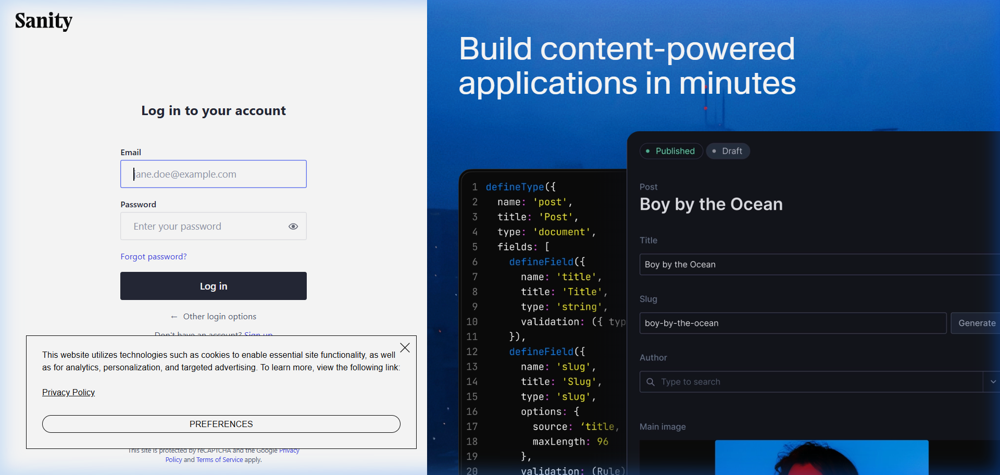

5.  Once logged in, you will be presented with the **Desk Structure Panel**. This sidebar organizes all your website collections and configurations into distinct lists: **Products**, **Testimonials**, **About Section Settings**, **Category Settings**, and **Delivery Settings**.

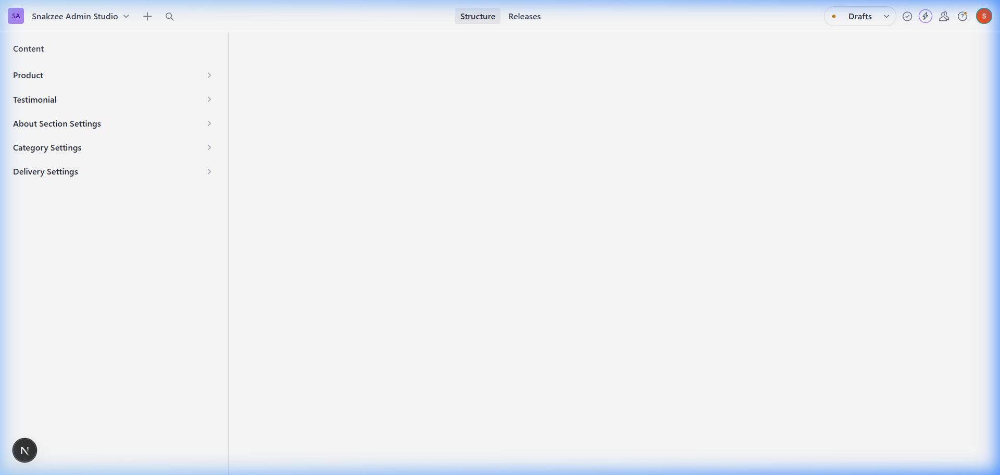

---

### A. Customizing the About Section
To change the story text or image in the About section of the website:
1.  In the Studio sidebar, click on **About Section Settings**.
2.  Select the **About Section Settings** document or click the create button if it is a new installation.
3.  You will be presented with the following editing fields:
    *   **Settings Name**: Prefilled as `About Section Settings` (read-only to maintain consistency).
    *   **Taste of Our Home Image**: The large photo representing the culinary process (e.g. nuvvula laddulu). Upload or drag a new image here.
    *   **About Story (English)**: The main textual description describing the kitchen's history.
    *   **About Story (Telugu Proverb / Tagline)**: A highlight subtitle in Telugu script.
4.  Click the green **Publish** button at the bottom right to push changes live.

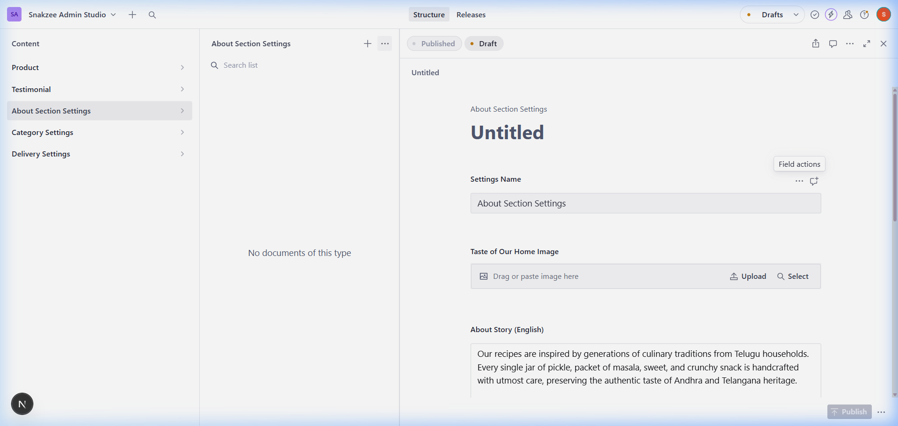

---

### B. Customizing Category Cover Images
To change the cover images shown in the four Category directory cards on the homepage:
1.  In the Studio sidebar, click on **Category Settings**.
2.  Select the **Category Images Settings** document.
3.  You will be presented with the image upload fields for each of the four core categories:
    *   **Pickles Category Image** (represented by raw mangoes / pickles)
    *   **Masalas Category Image** (represented by spices)
    *   **Sweets Category Image** (represented by sweets / laddus)
    *   **Snacks Category Image** (represented by crunchy rice crackers)
4.  Upload or drag-and-drop your custom images into each field.
5.  Click the green **Publish** button.

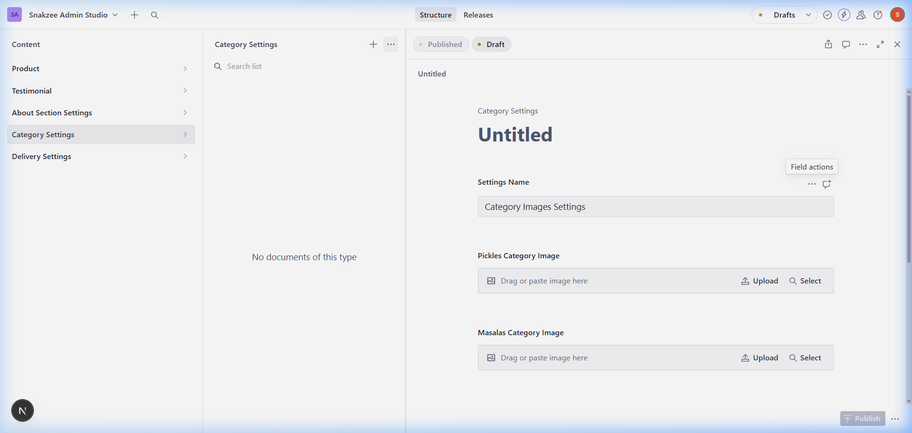

---

### C. Managing Dynamic Delivery Costs & Offers
You can adjust how much you charge for delivery and when delivery becomes free:
1.  In the Studio sidebar, click on **Delivery Settings**.
2.  Select the **Delivery Cost & Offers** document.
3.  Edit the two numeric inputs:
    *   **Delivery Cost (₹)**: The standard shipping fee applied to orders (e.g. `50`).
    *   **Free Delivery Threshold (₹)**: The minimum order subtotal required to get free delivery (e.g. `500`). If a customer's order meets or exceeds this price, the shipping charge drops to `₹0` automatically in their cart.
4.  Click the green **Publish** button.

*Note: If these values are deleted or unconfigured, the website defaults safely to ₹50 delivery fee and ₹500 free delivery threshold.*

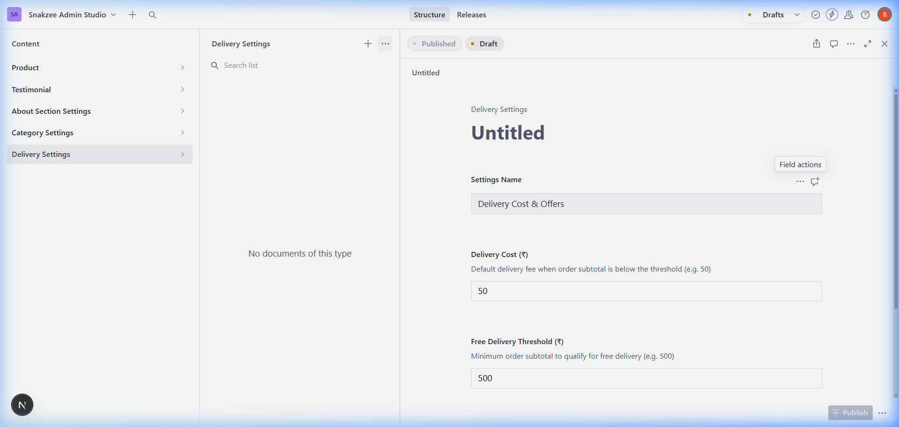

---

### D. Adding and Managing Products
To add a new snack or edit a price in your store catalog:
1.  In the Studio sidebar, click on **Products**.
2.  Click the **Create new document** button (+) at the top of the pane.
3.  Fill in the product details:
    *   **Product Name**: Name in English (e.g. `Karam Boondi`).
    *   **Telugu Name**: Telugu script representation (e.g. `కారం బూంది`).
    *   **Category**: Choose from the dropdown menu (`pickles`, `masalas`, `sweets`, or `snacks`).
    *   **Price**: Numeric price in Rupees (e.g. `150`).
    *   **Badge Text**: Optional overlay ribbon text (e.g. `Best Seller`, `Spicy`, `New`).
    *   **Is Hot?**: Toggle switch. Enabling this displays a flame icon overlay next to the product name.
    *   **Product Image**: Upload a high-quality picture.
    *   **Description**: Description of ingredients or flavors.
4.  Click the green **Publish** button.

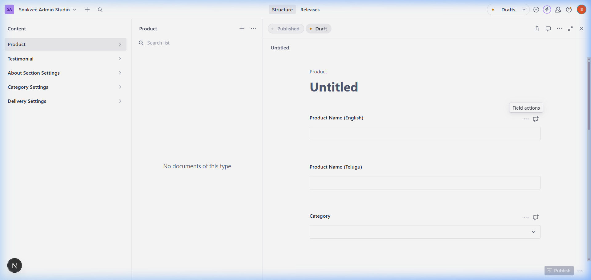

---

### E. Managing Customer Testimonials
To edit or add reviews to the client praise slider:
1.  In the Studio sidebar, click on **Testimonial**.
2.  Click the **Create new document** button (+) or click on an existing customer name to edit.
3.  Fill in the fields:
    *   **Customer Name** (e.g. `Ravi K.`)
    *   **Telugu Translation** (e.g. `రవి K.`)
    *   **Location** (e.g. `Visakhapatnam`)
    *   **Rating**: Integer from `1` to `5` stars (e.g. `5`).
    *   **Review Text**: The customer's quote.
4.  Click the green **Publish** button.

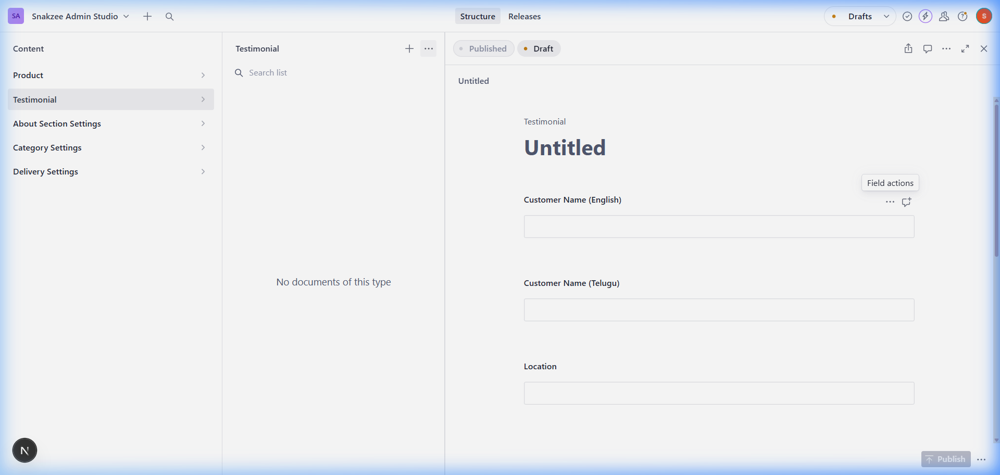

---

## 7. Order Logging & Supabase Integration
When a customer clicks **Place Order** in the Checkout dialog, the system executes two tasks:
1.  **Database Recording**: The order details (items, prices, customer name, mobile, address, pincode, timestamp) are logged to the `orders` table in your Supabase database. This creates a secure, permanent audit log of all orders.
2.  **WhatsApp Dispatch**: The system formats a first-person message with the order details and automatically opens WhatsApp Web (or the app) pre-filled to the store owner's number (`+91 88975 86142`). The user just has to click "Send" to place their order.

---

## 8. Deployment Guide

To deploy the SnakZee project to a production server (like Vercel):

1.  Push your codebase to a GitHub repository.
2.  Create a new project on **Vercel** and import your GitHub repository.
3.  Under the Vercel project configuration, add your **Environment Variables** (from your `.env.local` file).
4.  Vercel will build and deploy the site automatically.
5.  To build locally for production validation, run:
    ```bash
    npm run build
    npm run start
    ```

---

*This manual is client-ready and formatted for easy conversion to PDF/Word documents.*
